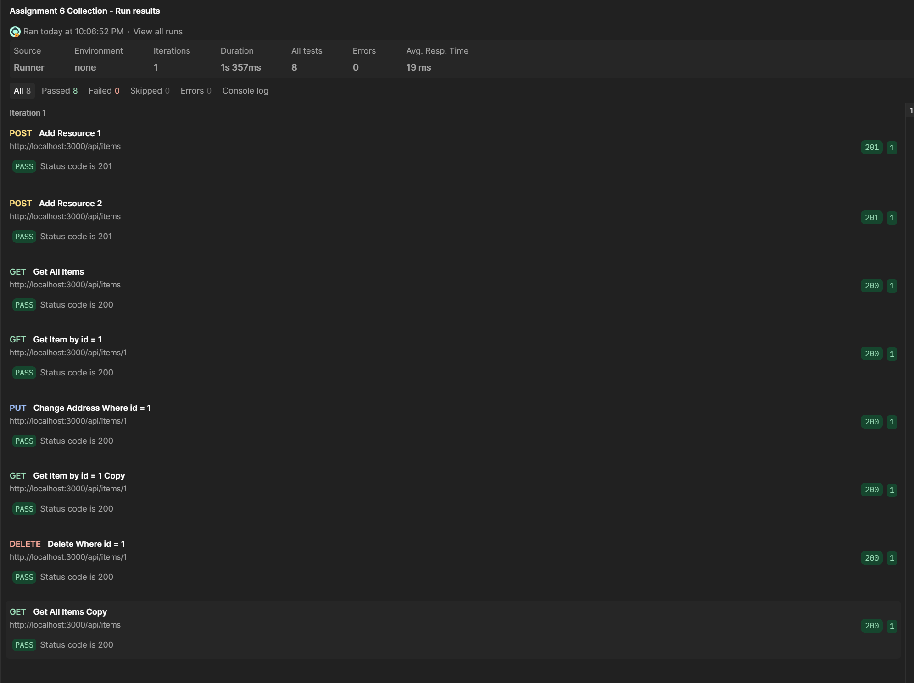

# Description
Educational Node.js/Express program that has the proper routes and fetch methods to perform basic database operations to a local database using the Postgre (npm: pg) framework.

These methods include:
- GET /api/items - Returns every row in the users table
- GET /api/items/{id} - Returns the users row that matches the id in the parameters
- POST /api/items - Adds a new item to the users table, takes a json object with the following format:

  ```js
  { first_name: String, last_name: String, age: int, address: String }
  ```
- PUT /api/items/{id} - Modifys the elements of the specified item in the mock DB, takes a json object that must have one valid field that is included in the users table columns.
- DELETE /api/items/{id} - Deletes the specified item in the users table

# Postman Testing Steps
In order to test that the SQL querys were working properly, I used Postman's automated testing feature, having it run a collection of 8 different http requests in the following order:
### 1. POST localhost:3000/api/items

  Request data:
  
```js
{
   "first_name": "John",
    "last_name": "Doe",
    "age": 32,
    "address": "1234 Real St."
}
```
  Response data:

```js
{
    "status": 201,
    "message": "user entry successfully created"
}
```

### 2. POST localhost:3000/api/items

  Request data:
  
```js
{
    "first_name": "Alice",
    "last_name": "Green",
    "age": 24,
    "address": "4321 Fake Ave."
}
```
  Response data:

```js
{
    "status": 201,
    "message": "user entry successfully created"
}
```

### 3. GET localhost:3000/api/items
  Response data:

```js
{
    "status": 200,
    "data": [
        {
            "id": 1,
            "first_name": "John",
            "last_name": "Doe",
            "age": 32,
            "address": "1234 Real St."
        },
        {
            "id": 2,
            "first_name": "Alice",
            "last_name": "Green",
            "age": 24,
            "address": "4321 Fake Ave."
        }
    ]
}
```

### 4. GET localhost:3000/api/items/1
  Response data:

```js
{
    "status": 200,
    "data": {
        "id": 1,
        "first_name": "John",
        "last_name": "Doe",
        "age": 32,
        "address": "1234 Real St."
    }
}
```

### 5. PUT localhost:3000/api/items/1
   Request data:
  
```js
{
    "address": "4567 Fictional Dr."
}
```

  Response data:

```js
{
    "status": 200,
    "message": "succesfully updated 1 row(s)"
}
```

### 6. GET localhost:3000/api/items/1
  Response data:

```js
{
    "status": 200,
    "data": {
        "id": 1,
        "first_name": "John",
        "last_name": "Doe",
        "age": 32,
        "address": "4567 Fictional Dr."
    }
}
```

### 7. DELETE localhost:3000/api/items/1
  Response data:

```js
{
    "status": 200,
    "message": "Deletion of user with id: 1 successfull"
}
```

### 8. GET localhost:3000/api/items
  Response data:

```js
{
    "status": 200,
    "data": [
        {
            "id": 2,
            "first_name": "Alice",
            "last_name": "Green",
            "age": 24,
            "address": "4321 Fake Ave."
        }
    ]
}
```

### Screen Capture of Postman Test Results

